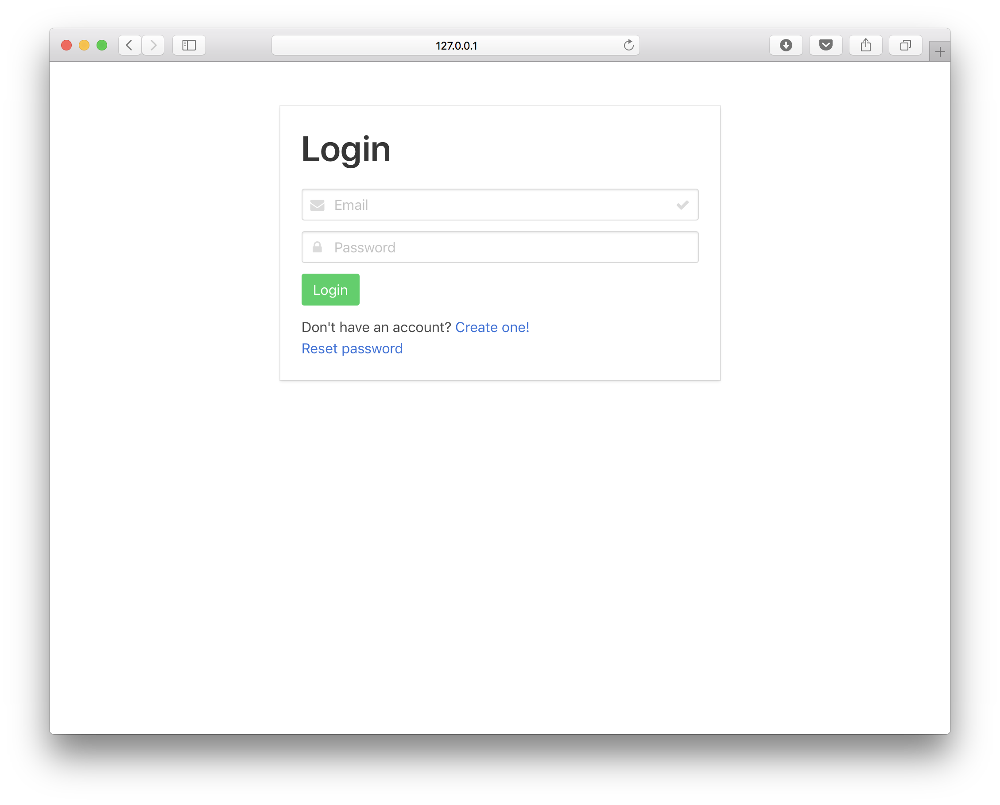
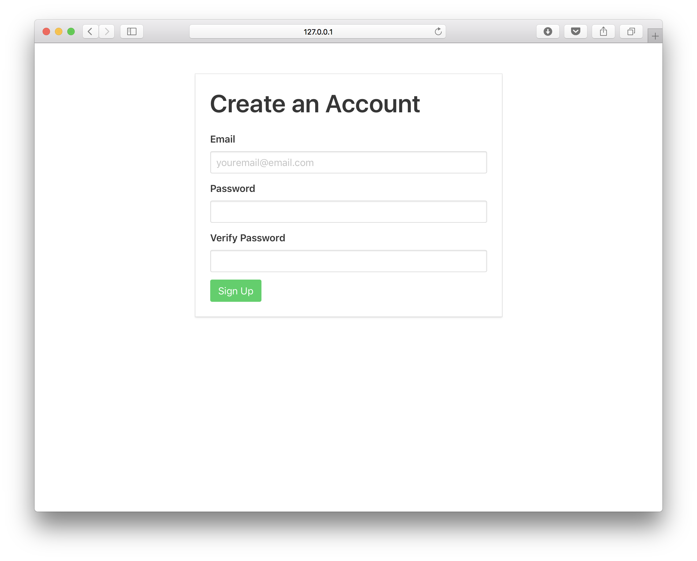
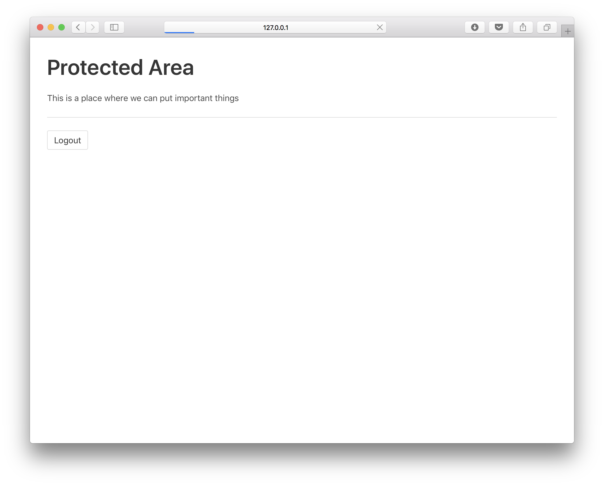

# Vue Webpack Bulma Starter + Firebase

> Vue App w/ Firebase Authentication Starter Template

* [Vue](https://vuejs.org)
* [Vue Router](https://router.vuejs.org)
* [Webpack](https://webpack.js.org)
* [Firebase](https://firebase.google.com)
* [Bulma](https://bulma.io)
* [Buefy](https://buefy.github.io)
* [Font Awesome](https://fontawesome.com)

Also includes:

* Hot Reload
* Lint-on-save
* CSS Extraction
* ESLint Airbnb
* Jest Unit
* Nightwatch E2E

3 Components ready to go: User Register, User Login and Protected Area.

### Login ###


### Register ###


### Protected ###



## Build Setup

``` bash
# install dependencies
npm install

# serve with hot reload at localhost:8080
npm run dev

# build for production with minification
npm run build

# build for production and view the bundle analyzer report
npm run build --report

# run unit tests
npm run unit

# run e2e tests
npm run e2e

# run all tests
npm test
```

For a detailed explanation on how things work, check out the [guide](http://vuejs-templates.github.io/webpack/) and [docs for vue-loader](http://vuejs.github.io/vue-loader).
